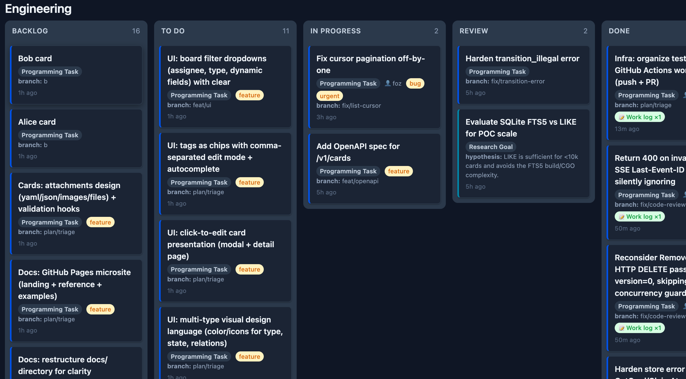

# Cards

Cards is a local coordination service for defining, reviewing and assigning tasks. A project defines
its card types, boards, columns, transitions, and extensions in a JSON or YAML schema.
The `cards` binary loads those definitions, stores card state and events in
SQLite, and exposes the same model through HTTP, CLI, MCP, and a small web UI.

It was built for projects where plain todos are too local, but a hosted tracker
is more process than the team needs. Humans, scripts, and agents can claim
cards, update typed fields, append evidence, and resume from the card history
later. The web board is useful, but it is only one view over the same API.



## How It Works

A card has a fixed envelope and schema-defined fields. The envelope gives every
card an `id`, `type_id`, `title`, `status`, `owner`, `version`, links, comments,
and timestamps. The custom data lives under `card.fields` and is validated by
the card type.

Here is a shortened task definition:

```json
{
  "id": "programming-task",
  "name": "Programming Task",
  "schema_version": 1,
  "fields": [
    { "id": "description", "type": "text", "required": true },
    { "id": "branch", "type": "string", "required": true },
    {
      "id": "work_log",
      "type": "repeating",
      "item_fields": [
        { "id": "notes", "type": "text" },
        { "id": "author", "type": "user", "required": true }
      ]
    }
  ],
  "allowed_columns": ["backlog", "todo", "in_progress", "review", "done"]
}
```

That same definition drives the API, CLI, MCP tool schema, and UI form. Adding a
field to the card type changes the contract everywhere without adding a separate
UI model.

Boards are views over cards. They choose the types and columns to show, and can
add transition rules such as `todo -> in_progress -> review -> done`. Cards
live in one workspace, statuses come from the workspace columns, and boards add
useful constraints without owning a separate copy of the data.

## Quick Start

You need Go `1.26.4` or newer as declared in `go.mod`. There is no separate
database server; the project uses embedded SQLite through `modernc.org/sqlite`.

Build and run the demo workspace:

```bash
go build -o cards ./cmd/cards
./cards serve --workspace ./examples/demo-workspace --port 8787 --seed
open http://127.0.0.1:8787/ui/boards/engineering
```

The server exposes the API under `/v1` and writes `work-cards.db` in the
workspace directory. Create a card through HTTP:

```bash
curl -X POST http://127.0.0.1:8787/v1/cards \
  -H "Content-Type: application/json" \
  -H "X-Work-Cards-Actor: alice" \
  -H "Idempotency-Key: demo-create-oauth" \
  -d '{
    "type_id": "programming-task",
    "title": "Implement OAuth flow",
    "status": "todo",
    "fields": {
      "description": "Add GitHub OAuth to the local sign-in flow.",
      "branch": "feat/oauth"
    }
  }'
```

Use the CLI against the same server:

```bash
export CARDS_URL=http://127.0.0.1:8787/v1
export CARDS_USER=alice

./cards list --board engineering --status todo
./cards take-next --board engineering --type programming-task --status in_progress
./cards history card_123
```

For MCP clients, run the stdio server:

```bash
./cards mcp --workspace ./examples/demo-workspace
```

## Configuration

A workspace is a directory with `definitions/` and, after the server starts, a
SQLite database:

```text
workspace/
  work-cards.db
  definitions/
    workspace.json
    card-types/
      programming-task.json
    boards/
      engineering.json
    extensions.json
  artifacts/
  .cards/ext/
```

`definitions/workspace.json` declares the shared vocabulary: columns, tags,
link types, users, and settings such as `enforce_transitions`, `strict_fields`,
`tag_policy`, and `default_user`. Card types define the shape of `fields`.
Boards define filtered views and transition rules.

The field catalog is intentionally small: `string`, `text`, `number`, `date`,
`enum`, `tags`, `user`, `card_link`, `repeating`, and `artifact`. More specific
behavior, such as validating a file path or starting CI, belongs in an extension
that reads cards and writes results back through the API.

## API And Runtime Behavior

All transports use the same service layer. That layer handles schema validation,
transition checks, optimistic concurrency, idempotency, event creation, links,
comments, and full-text indexing.

Mutating an existing card requires the current `version`; a stale write returns
a structured `version_conflict` error with the current card attached. Retried
writes can use `Idempotency-Key`, scoped per actor, so a network retry does not
create duplicate cards or claim a different next task.

The event stream is available at `GET /v1/events/stream` over SSE, with
`Last-Event-ID` replay for clients that reconnect.

## Extensions

Extensions are normal processes. The core does not load plugin code; it starts
a declared command for hooks or lets a service subscribe to the API and event
stream. A hook can be as small as:

```json
{
  "extensions": [
    {
      "id": "review-notify",
      "kind": "hook",
      "on": "status_changed",
      "filter": { "board_id": "engineering", "to_status": "review" },
      "run": ["bash", ".cards/ext/notify.sh"]
    }
  ]
}
```

Run declared hooks with the server, or run the supervisor separately:

```bash
./cards serve --workspace ./examples/demo-workspace --run-extensions
./cards run-extensions --workspace ./examples/demo-workspace
```

## Project Layout

The binary entry points live in `cmd/cards/`. The service model is in
`internal/core/`, with transports in `internal/httpapi/`, `internal/cli/`, and
`internal/mcp/`. Workspace loading, SQLite storage, and hooks live in
`internal/config/`, `internal/sqlite/`, and `internal/hooks/`. The demo
workspace is under `examples/`, and the longer design references are in `docs/`.

## Documentation And Development

Start with [`docs/CONCEPTS.md`](docs/CONCEPTS.md) for the vocabulary
(workspaces, boards, card types) and how setups differ by use case, then
[`docs/DEVELOPER-REFERENCE.md`](docs/DEVELOPER-REFERENCE.md) for workspace
authoring and [`docs/SPEC.md`](docs/SPEC.md) for the API and data
model. Design background is in [`docs/PHILOSOPHY.md`](docs/PHILOSOPHY.md) and
[`docs/ARCHITECTURE.md`](docs/ARCHITECTURE.md); agent and extension details are
in [`docs/MCP.md`](docs/MCP.md) and [`docs/EXTENSIONS.md`](docs/EXTENSIONS.md).

Work Cards is in beta. The core service, HTTP API, CLI, MCP server, web UI, and
hook system are implemented, but the API should still be treated as
project-local unless a release notes otherwise.

PRs and issue reports are welcome. For local development, build with
`go build ./cmd/cards`, run the demo workspace, and use the docs above as the
current contract for changes.

## License

MIT
