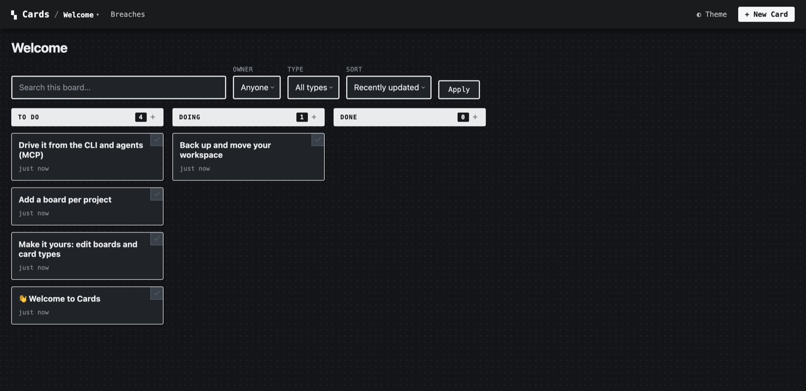

# Get started

Install Cards, create a workspace, and connect an agent — about two minutes end
to end. No account, no cloud, no database server.

## 1. Install

=== "Download a binary (no toolchain)"

    Grab the archive for your platform from the
    [latest release](https://github.com/somebox/cards/releases/latest)
    (`linux` / `darwin` / `windows` × `amd64` / `arm64`). For macOS on Apple
    Silicon:

    ```bash
    curl -L -o cards.tar.gz \
      https://github.com/somebox/cards/releases/latest/download/cards_darwin_arm64.tar.gz
    tar -xzf cards.tar.gz && cd cards_darwin_arm64
    ./cards version
    ```

    !!! note "macOS Gatekeeper"
        The first run of an unsigned download is quarantined. Clear it with
        `xattr -d com.apple.quarantine ./cards` (or right-click → Open). Then
        move it onto your `PATH`: `sudo mv cards /usr/local/bin/`.

=== "Build from source (Go 1.26.4+)"

    ```bash
    go install github.com/somebox/cards/cmd/cards@latest
    # or, from a checkout:
    go build -o cards ./cmd/cards
    ```

## 2. Create a workspace and serve it

```bash
cards init          # scaffold ./.cards with a starter "welcome" board
cards serve         # serve at http://127.0.0.1:8787
open http://127.0.0.1:8787/ui/boards/welcome
```

That's the whole system: one `.cards/` folder holding your definitions and a
`work-cards.db` SQLite file, with a web UI, a `/v1` REST API, and an MCP
interface over it. `cards serve` with no `--workspace` walks up for a `.cards/`
directory the way git finds `.git/`, falling back to `~/.cards`.

<figure markdown>
  { .cards-shot }
  <figcaption>What you get after <code>cards init</code> — the starter cards walk you through the basics.</figcaption>
</figure>

## 3. Use the board

On the **welcome** board, click a card to edit its fields inline, drag it
between columns, or attach a file. Every change is a typed, validated event on
the same service layer the API and agents use.

Drive the same board from the command line — point the CLI at the running server
so its live UI stays in sync:

```bash
export CARDS_URL=http://127.0.0.1:8787   # target the server (omit to run serverless)
export CARDS_USER=me                     # actor for writes

cards create --type task --title "My first task" --status todo
cards list                               # the board as JSON lines
cards patch <id> --status in_progress --version 1
cards comment add <id> --body "on it"
```

→ Full command reference: [CLI](reference/cli.md).

## 4. Point an agent at it

The same workspace speaks MCP over stdio, so an agent harness can claim cards,
patch typed fields, and resume from history:

```bash
cards mcp          # stdio MCP server over the resolved workspace
```

→ Wiring it into Claude Code / pi / Cursor and the coordination loop:
[MCP quickstart](agents/mcp.md).

## 5. (Optional) Run the project's own board

Cards is developed on its own board. The bundled demo workspace is the real
engineering backlog, shipped as a portable `backlog.jsonl` snapshot:

```bash
cards serve --workspace ./examples/demo-workspace --port 8787 --seed
open http://127.0.0.1:8787/ui/boards/engineering
```

Because the snapshot is committed, cloning the repo clones the board. See
[Concepts](concepts/index.md) for the model and
[card definitions](reference/card-definitions.md) for
defining your own types.

---

!!! info "Beta"
    Cards is `v0.1.x`. The core service, HTTP API, CLI, MCP server, web UI, and
    hook system are implemented; treat the API as project-local unless a release
    says otherwise. For a code-verified map of what's built vs. proposed, see the
    [built-vs-proposed audit](reference/implementation-status.md).
