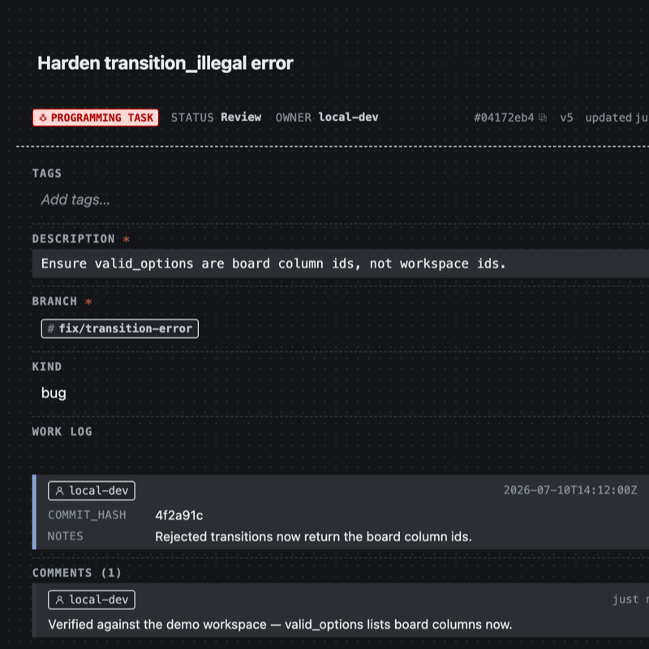
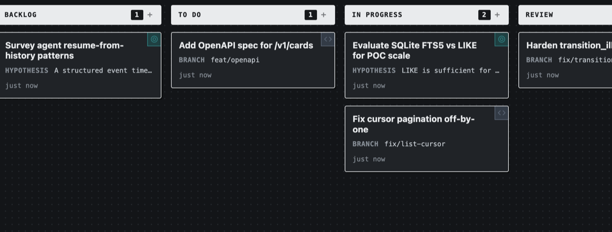
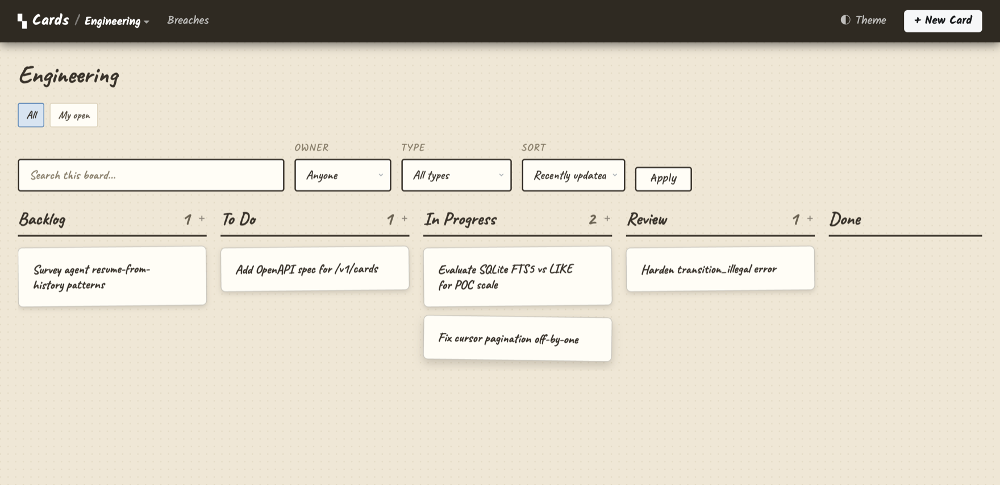
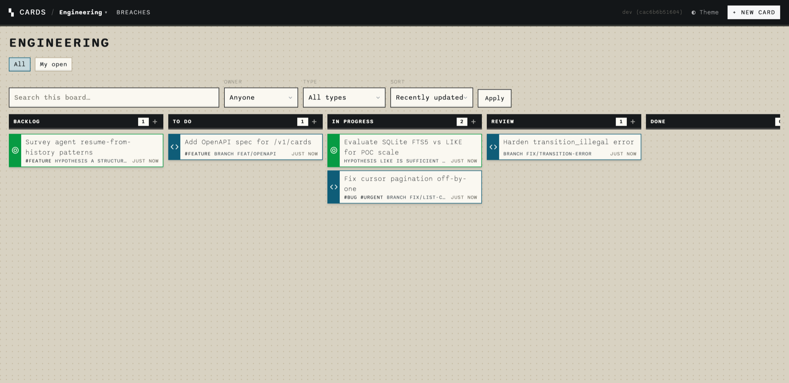
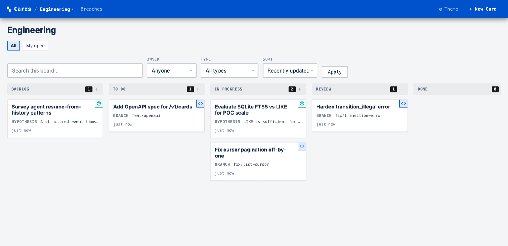

# Cards

Cards is a kanban board that lives in a folder on your machine. You describe
a card type in JSON — the fields on a task, a bug, a shop-floor job — and the
same definition drives the web UI, the CLI, the REST API, and the MCP tools
agents call. One binary, one SQLite file, no cloud account.

Reach for it when a TODO file is too little structure and a hosted tracker is
too much ceremony: solo work, small teams, agent harnesses that need a shared
typed board. It is not a Jira replacement, not an agent framework, and not a
hosted multi-tenant service — [the philosophy](concepts/philosophy.md) draws
the line.

<span class="cards-badge">v0.1.x · beta</span>
&nbsp;Local-only by default · SQLite-backed · git-portable · MIT.

[Get started](get-started.md){ .md-button .md-button--primary }
[Connect an agent (MCP)](agents/mcp.md){ .md-button }
[Agent instructions](agents/instructions.md){ .md-button }

## Definitions in, tracker out

A card type defines the fields; the detail page renders from it. A board
definition picks columns, card types, and transition rules; the lanes render
from that. There is no separate UI configuration.

<div class="cards-duo" markdown>

```json title="definitions/card-types/programming-task.json"
{
  "id": "programming-task",
  "name": "Programming Task",
  "fields": [
    { "id": "description", "type": "text",
      "required": true },
    { "id": "branch", "type": "string",
      "required": true, "display": "badge" },
    { "id": "kind", "type": "enum",
      "options": ["feature", "bug", "design", "infra"] },
    { "id": "work_log", "type": "repeating",
      "display": "feed",
      "item_fields": [
        { "id": "commit_hash", "type": "string",
          "required": true },
        { "id": "notes", "type": "text" }
      ] }
  ],
  "allowed_columns": ["backlog", "todo",
    "in_progress", "review", "done"]
}
```

<figure markdown>
  { .cards-shot }
  <figcaption>The card that schema renders: badge, enum, work-log feed, comments.</figcaption>
</figure>

```json title="definitions/boards/engineering.json"
{
  "id": "engineering",
  "columns": ["backlog", "todo",
    "in_progress", "review", "done"],
  "card_type_ids": ["programming-task",
    "research-goal", "api-task"],
  "settings": { "enforce_transitions": true },
  "wip_limits": { "in_progress": 3 },
  "transitions": {
    "backlog": ["todo"],
    "todo": ["in_progress"],
    "in_progress": ["review"],
    "review": ["done", "in_progress"]
  }
}
```

<figure markdown>
  { .cards-shot }
  <figcaption>The columns that board draws, with per-type preview fields.</figcaption>
</figure>

</div>

<div class="grid cards" markdown>

-   :material-cube-outline:{ .ic-nav } **Local-first**

    ---

    Your tracker runs on your machine and answers to you. Cards persist to
    plain files and a SQLite database inside your project — no account, no
    service, and nothing between you and your tasks.

-   :material-shape-outline:{ .ic-schema } **Schemas drive everything**

    ---

    A workspace is a folder of JSON definitions: card types (one file each),
    boards that combine them, columns, and tags. A card type's definition is
    the web form, the API contract, the CLI surface, and the generated MCP
    tools — change it once and every interface follows.

-   :material-source-branch:{ .ic-nav } **Git-portable**

    ---

    `cards export` snapshots the whole board — cards, comments, links — into a
    `backlog.jsonl` you commit next to the definitions. A collaborator pulls,
    imports the same board, and keeps working.

-   :material-tune-variant:{ .ic-nav } **Customizable**

    ---

    The core stays simple: cards, columns, events. Themes restyle the UI,
    transitions and WIP limits add process where you want it, new card types
    model your work, and hooks and extensions connect outside tools. All
    optional.

</div>

## :material-source-branch:{ .ic-nav } Your work stays in your repo

If you are doing agentic dev work, the key property is that the cards live
with the code.

`definitions/` is plain JSON under version control. Live state is one SQLite
file, and `cards export --state-only` snapshots it — every card, comment, and
link — into a `backlog.jsonl` that diffs cleanly in review. This repo does
exactly that: the bundled demo workspace is the project's real backlog.

Compare that with how agent-task coordination usually goes. Copilot
coordinates through GitHub Issues; Hermes ships its own kanban plugin; most
harnesses accumulate a private task list. Those work well inside their own
ecosystems, but the board is tied to the vendor's AI or the harness's format,
and moving your work means starting over.

Cards keeps coordination in an HTTP API and an MCP server over files in your
repo. Any agent that can speak either one can read and write the board — you
can switch harnesses, run two side by side, or `grep` your own backlog. No
tool owns your work.

→ [The workflow](using-cards.md) — a working session end to end, and
what the committed snapshot buys you

## :material-robot-outline:{ .ic-agent } A board beats a markdown plan

If you run multi-agent or subagent workflows, you have probably coordinated
them through a markdown file — a `plan.md` the agent rewrites every pass until
the diff is unreadable, and that breaks down entirely when two agents edit it
at once. A board is a better shared surface:

- **Typed fields hold the state.** A bad write is rejected with the field, the
  value, and what was allowed — an agent cannot accidentally reformat the plan.
- **Comments hold the conversation.** You can read back why a card moved, not
  just that it did.
- **Work logs and attachments hold the evidence.** A `repeating` field collects
  commit hashes, notes, and authors as a feed; `artifact` fields hold the
  files.
- **Every change is a versioned event.** Two agents writing the same card is a
  `version_conflict`, not a silent overwrite, and `take_next` assigns each
  worker its own card atomically.

From a card type, the MCP server generates typed tools; validation errors
carry the allowed values so agents correct themselves:

<div class="cards-duo" markdown>

```text title="Generated MCP tools"
workspace
create_programming-task
update_programming-task
take_next
claim / release
add_comment / append_entry
history / events / breaches
```

```json title="A rejected write"
{
  "error": "invalid_field",
  "field": "status",
  "message": "\"doing\" is not an allowed column",
  "valid_options": ["backlog", "todo",
    "in_progress", "review", "done"]
}
```

</div>

Claude Code, pi, or a plain shell script — anything that speaks MCP or HTTP —
can claim a card, work it, log what it did, and move on.

→ [Connect an agent](agents/mcp.md) · [Agent instructions](agents/instructions.md)

## :material-console:{ .ic-cli } The same board from your terminal

Every operation works from the CLI — serverless against the workspace folder,
or pointed at a running server with `CARDS_URL`. Output is JSON (`-q` prints
just the id), so it pipes.

<div class="cards-term">
<div class="cards-term__bar"><span class="cards-term__dot cards-term__dot--r"></span><span class="cards-term__dot cards-term__dot--y"></span><span class="cards-term__dot cards-term__dot--g"></span></div>
<pre><span class="tp">$</span> <span class="tc">cards create --type task --title "Draft changelog" --status todo -q</span>
<span class="to">card_5f03f5f9</span>
<span class="tp">$</span> <span class="tc">cards take-next --board engineering --type programming-task -q</span>
<span class="to">card_7e090c38</span>
<span class="tp">$</span> <span class="tc">cards patch card_7e090c38 --status review --version 2 -q</span>
<span class="to">card_7e090c38</span>
<span class="tp">$</span> <span class="tc">cards comment add card_7e090c38 --body "fix pushed, PR #212" -q</span>
<span class="to">card_7e090c38</span></pre>
</div>

→ [Using Cards](using-cards.md) — every operation with CLI, HTTP,
and MCP examples side by side

## :material-palette-outline:{ .ic-board } Themes

Themes are one scoped CSS file in the workspace — no build step, no fork. A
theme that fails validation is rejected and the UI falls back to the default.
The built-in and demo themes:

<div class="cards-gallery" markdown>

<figure markdown>
  { .cards-shot }
  <figcaption><code>journal</code> — paper background, handwritten type</figcaption>
</figure>

<figure markdown>
  { .cards-shot }
  <figcaption><code>labels</code> — monospace type, colored card accents</figcaption>
</figure>

<figure markdown>
  { .cards-shot }
  <figcaption><code>jeeruh</code> — conventional tracker styling in blue</figcaption>
</figure>

</div>

→ [Themes guide](guides/themes.md) — writing and installing your own

## :material-book-open-variant:{ .ic-nav } Documentation

<div class="grid cards" markdown>

-   ### :material-rocket-launch-outline:{ .ic-nav } [Get started](get-started.md)

    ---

    Install, create a workspace, serve the board, connect an agent. About two
    minutes.

-   ### :material-shape-outline:{ .ic-schema } [Define card schemas](reference/card-definitions.md)

    ---

    Card types, the ten field types, validation rules, and schema versioning.

-   ### :material-view-column-outline:{ .ic-board } [Workspace & boards](reference/workspace-and-boards.md)

    ---

    Columns, boards as filtered views, transitions, WIP limits, and monitors.

-   ### :material-robot-outline:{ .ic-agent } [Agents & MCP](agents/mcp.md)

    ---

    Run the MCP server, wire it into a harness, and follow the coordination
    loop.

-   ### :material-console:{ .ic-cli } [Using Cards](using-cards.md)

    ---

    Every operation documented once, with CLI, HTTP, and MCP examples and
    real responses side by side.

-   ### :material-palette-outline:{ .ic-board } [Themes](guides/themes.md)

    ---

    What themes can customize, the validation rules, and how to install and
    share one.

-   ### :material-broadcast:{ .ic-api } [Events & extensions](extensions/index.md)

    ---

    Hooks, services, and the SSE event stream — automation lives outside the
    core.

-   ### :material-file-document-outline:{ .ic-nav } [Specification](spec/index.md)

    ---

    The full contract: API surface, data model, query DSL, and the
    code-verified audit of what's built.

</div>

---

[Get started](get-started.md){ .md-button .md-button--primary }
[Read the concepts](concepts/index.md){ .md-button }
[See what's actually built](reference/implementation-status.md){ .md-button }
