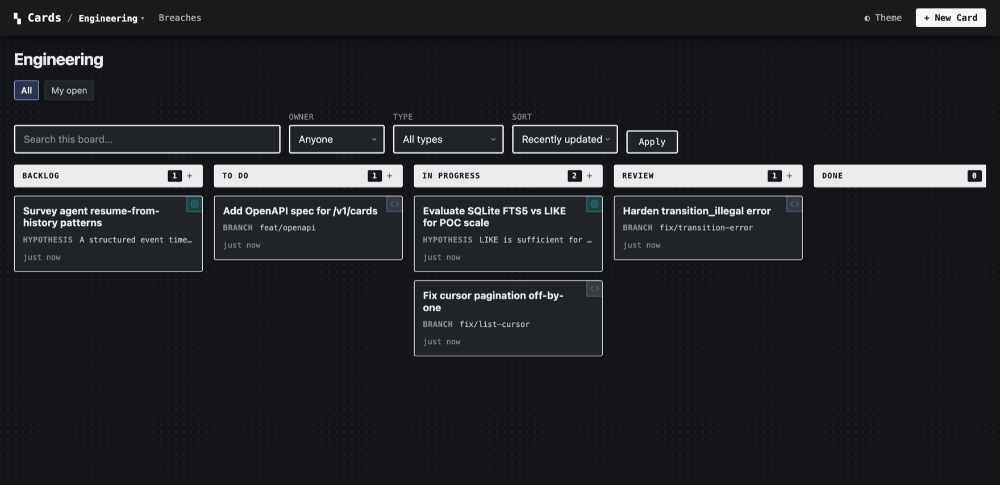

# Cards

Cards is a self-contained service for tracking work on typed cards — tasks,
bugs, notes, anything you define in JSON. One binary and one SQLite file give
you a web board, a REST API, a CLI, and an MCP server for agents, all
validating against the same schema.

<span class="cards-badge">v0.1.x · beta</span>
&nbsp;Local-only by default · SQLite-backed · git-portable · MIT.

[Get started](get-started.md){ .md-button .md-button--primary }
[Connect an agent (MCP)](agents/mcp.md){ .md-button }
[GitHub](https://github.com/somebox/cards){ .md-button }

<figure markdown>
  { .cards-shot }
  <figcaption>The bundled engineering board — this project's own backlog, which ships with the repo.</figcaption>
</figure>

Cards is built for projects where a TODO file is too little structure and a
hosted tracker is too much overhead. `cards init && cards serve` gives you a
board, an API, and an agent interface over one `.cards/` folder. No account, no
cloud, nothing to operate.

<div class="grid cards" markdown>

-   :material-cube-outline:{ .ic-nav } **Local-first**

    ---

    One binary with embedded SQLite (pure-Go `modernc.org/sqlite`, no CGO). It
    runs on `localhost`, single-user, with no accounts or permissions to
    manage. Isolation is the host's responsibility, by design.

-   :material-shape-outline:{ .ic-schema } **One schema, four interfaces**

    ---

    You define a card type once, in JSON. That definition is the web form, the
    API contract, the CLI surface, and the generated MCP tools. Add a field and
    every surface picks it up — there is no separate UI model to drift out of
    sync.

-   :material-source-branch:{ .ic-nav } **Git-portable**

    ---

    Definitions are plain files you commit. Board state exports to a
    `backlog.jsonl` snapshot that diffs cleanly in review. Cloning the repo
    restores the whole board — cards, comments, links.

</div>

## :material-shape-outline:{ .ic-schema } One schema, four interfaces

The `programming-task.json` below is the only definition. Here is what it
turns into.

=== "The schema"

    ```json title="definitions/card-types/programming-task.json"
    {
      "id": "programming-task",
      "name": "Programming Task",
      "schema_version": 1,
      "fields": [
        { "id": "description", "type": "text",   "required": true, "display": "monospace" },
        { "id": "branch",      "type": "string", "required": true, "display": "badge" },
        { "id": "kind", "type": "enum",
          "options": ["feature", "bug", "design", "infra"] },
        { "id": "work_log", "type": "repeating", "display": "feed",
          "item_fields": [
            { "id": "commit_hash", "type": "string", "required": true },
            { "id": "author",      "type": "user",   "required": true }
          ] }
      ],
      "allowed_columns": ["backlog", "todo", "in_progress", "review", "done"]
    }
    ```

=== "The board"

    { .cards-shot }

    The `display` hints (`badge`, `monospace`, `feed`) and the `kind` enum
    drive how the card renders — no template changes.

=== "The agent tools (MCP)"

    From that one type, the MCP server publishes typed tools automatically:

    ```text
    workspace              # introspect columns, types, boards
    create_programming-task
    update_programming-task
    take_next              # atomically claim the next eligible card
    claim / release / add_comment / append_entry / history …
    ```

    Unknown fields are rejected at the protocol layer, and validation errors
    name the field and the allowed values so an agent can correct itself:

    ```json
    {
      "error": "invalid_field",
      "field": "status",
      "message": "\"doing\" is not an allowed column",
      "valid_options": ["backlog", "todo", "in_progress", "review", "done"]
    }
    ```

## :material-source-branch:{ .ic-nav } Your work stays in your repo

If you are doing agentic dev work, this is the argument that matters most: the
cards live with the code.

`definitions/` is plain JSON under version control. Live state is one SQLite
file, and `cards export --state-only` snapshots it — every card, comment, and
link — into a `backlog.jsonl` that diffs cleanly in review. Commit it, push it,
clone it on another machine, `cards import`, keep working. This repo does
exactly that: the bundled demo workspace is the project's real backlog.

Compare that with how agent-task coordination usually goes. Copilot
coordinates through GitHub Issues; Hermes ships its own kanban plugin; most
harnesses accumulate a private task list. Those work well inside their own
ecosystems, but the board is tied to the vendor's AI or the harness's format,
and moving your work means starting over.

Cards keeps coordination in an HTTP API and an MCP server over files in your
repo. Any agent that can speak either one can read and write the board — you
can switch harnesses, run two side by side, or `grep` your own backlog. No
tool owns your work.

## :material-robot-outline:{ .ic-agent } A board beats a markdown plan

If you run multi-agent or subagent workflows, you have probably coordinated
them through a markdown file — a `plan.md` the agent rewrites every pass until
the diff is unreadable, and that breaks down entirely when two agents edit it
at once. A board is a better shared surface:

- **Typed fields hold the state.** A bad write is rejected with the field, the
  value, and what was allowed — an agent cannot accidentally reformat the plan.
- **Comments hold the conversation.** You can read back why a card moved, not
  just that it did.
- **Work logs and attachments hold the evidence.** A `repeating` field collects
  commit hashes, notes, and authors as a feed; `artifact` fields hold the
  files.
- **Every change is a versioned event.** Two agents writing the same card is a
  `version_conflict`, not a silent overwrite, and `take_next` assigns each
  worker its own card atomically.

Claude Code, pi, or a plain shell script — anything that speaks MCP or HTTP —
can claim a card, work it, log what it did, and move on. You get history for
free, the conversations stay readable, and subagents stop contending for a
scratch file.

→ [Wire up an agent](agents/mcp.md)

## :material-palette-outline:{ .ic-board } Themes

Themes are one scoped CSS file in the workspace — no build step, no fork. A
theme that fails validation is rejected and the UI falls back to the default.
The built-in and demo themes:

<div class="cards-gallery" markdown>

<figure markdown>
  { .cards-shot }
  <figcaption><code>journal</code> — paper background, handwritten type</figcaption>
</figure>

<figure markdown>
  { .cards-shot }
  <figcaption><code>labels</code> — monospace type, colored card accents</figcaption>
</figure>

<figure markdown>
  { .cards-shot }
  <figcaption><code>jeeruh</code> — conventional tracker styling in blue</figcaption>
</figure>

</div>

→ [The themes guide](design/THEMES.md) covers writing your own.

## :material-book-open-variant:{ .ic-nav } Documentation

<div class="grid cards" markdown>

-   :material-rocket-launch-outline:{ .ic-nav } **[Get started](get-started.md)**

    ---

    Install, create a workspace, serve the board, connect an agent. About two
    minutes.

-   :material-shape-outline:{ .ic-schema } **[Define card schemas](reference/DEVELOPER-REFERENCE-SCHEMA-AUTHORING.md)**

    ---

    Card types, the ten field types, validation rules, and schema versioning.

-   :material-view-column-outline:{ .ic-board } **[Workspace & boards](reference/DEVELOPER-REFERENCE.md)**

    ---

    Columns, boards as filtered views, transitions, WIP limits, and monitors.

-   :material-robot-outline:{ .ic-agent } **[Agents & MCP](agents/mcp.md)**

    ---

    Run the MCP server, wire it into a harness, and follow the coordination
    loop.

-   :material-console:{ .ic-cli } **[CLI reference](reference/DEVELOPER-REFERENCE-CLI.md)**

    ---

    Every command, serverless or against a running server: `create`, `list`,
    `patch`, `take-next`, `export`, `import`.

-   :material-palette-outline:{ .ic-board } **[Themes](design/THEMES.md)**

    ---

    The theme contract: tokens, stable hooks, validation, and how to share a
    theme.

-   :material-broadcast:{ .ic-api } **[Events & extensions](extensions/EXTENSIONS.md)**

    ---

    Hooks, services, and the SSE event stream — automation lives outside the
    core.

-   :material-file-document-outline:{ .ic-nav } **[Specification](spec/SPEC.md)**

    ---

    The full contract: API surface, data model, query DSL, and the
    code-verified audit of what's built.

</div>

## Who it's for

<div class="grid cards" markdown>

-   **The solo dev / small team**

    ---

    You want less process, not more. A board and a queryable history in your
    git repo, running locally, with nothing to set up or pay for.

-   **The agent / tooling person**

    ---

    Your harness needs a typed board to coordinate on — not another ad-hoc
    scratch DB, and not a vendor's issue tracker. MCP is a first-class
    interface here.

-   **The schema author**

    ---

    Your work isn't generic tickets — research goals, print jobs, review
    checklists. Model it once and the UI and the agents follow the same rules.

</div>

## What Cards is not

Just as important is what Cards doesn't try to be:

- **Not a Jira/Linear replacement.** It's a small substrate, not a process
  suite. No sprints-as-a-feature, no roadmap engine, no automation DSL.
- **Not an agent framework.** It's a coordination surface agents talk to over
  an API and an event stream — it doesn't run your agents.
- **Not a hosted, multi-tenant service.** Default deployment is single-user on
  `localhost`. Auth and isolation belong to the host, by design.
- **Not a plugin host.** Extensions are independent processes (any language)
  that talk to the API — the core never loads their code.

If you need a shared, permissioned, hosted tracker with SLAs and org-wide
reporting, Cards isn't it. The full principles are in
[Why Cards](concepts/PHILOSOPHY.md).

---

[Get started](get-started.md){ .md-button .md-button--primary }
[Read the concepts](concepts/CONCEPTS.md){ .md-button }
[See what's actually built](reference/INTEGRATOR-REFERENCE.md){ .md-button }
