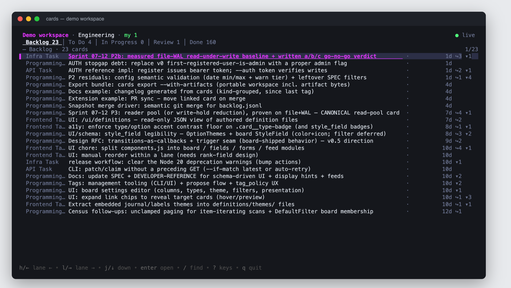

# CLI usage

Everything Cards does is available from the `cards` binary. This page covers
getting it installed and wired to a project, the two backends, and the full
command surface. Per-operation examples with responses — including the HTTP
and MCP equivalents — are in [using Cards](../using-cards.md).

## Install

=== "Download a binary"

    Grab your platform's archive from the
    [latest release](https://github.com/somebox/cards/releases/latest)
    (`linux` / `darwin` / `windows` × `amd64` / `arm64`):

    ```console
    $ curl -L -o cards.tar.gz \
        https://github.com/somebox/cards/releases/latest/download/cards_darwin_arm64.tar.gz
    $ tar -xzf cards.tar.gz && sudo mv cards_darwin_arm64/cards /usr/local/bin/
    $ cards version
    ```

    On macOS, clear Gatekeeper quarantine on first run:
    `xattr -d com.apple.quarantine /usr/local/bin/cards`.

=== "Build from source (Go 1.26.4+)"

    ```console
    $ go install github.com/somebox/cards/cmd/cards@latest
    # or from a checkout:
    $ go build -o cards ./cmd/cards
    ```

## Set up a project

```console
$ cd my-project
$ cards init          # scaffolds ./.cards (definitions + starter welcome board)
$ cards serve         # http://127.0.0.1:8787
```

`cards` resolves its workspace the way git finds `.git/`: the nearest
`.cards/` walking up from the current directory, falling back to a personal
workspace at `~/.cards`. `cards init --global` creates the personal one;
`--workspace <dir>` is always the explicit override.

## Two backends

Client commands (`list`, `create`, `patch`, …) work in either of two modes:

| Mode | When | How |
|---|---|---|
| **Serverless** (default) | No server running; scripts, CI, quick edits | Runs the same service in-process against the resolved workspace |
| **Server** | A `cards serve` is up | Set `CARDS_URL` (or `--url`) to target it |

Prefer the server when one is running: a serverless write bypasses that
process's event bus, so its live board and hooks won't see the change.
`--workspace` applies to the serverless path only (combining it with `--url`
is an error).

## Environment

| Variable | Purpose |
|---|---|
| `CARDS_URL` | API base. **Unset = serverless.** |
| `CARDS_WORKSPACE` | Workspace directory for serverless mode |
| `CARDS_USER` | Default actor for writes (`--as` overrides per command) |

## Terminal UI

A bare `cards` (no command) opens an interactive terminal UI when **stdin and
stdout are both TTYs** and neither `--json` nor `--jsonl` is set. In scripts,
pipes, and agent shells it prints usage instead, so automation is unaffected.

The TUI runs **serverless** against the resolved workspace (same precedence:
`--workspace` → `CARDS_WORKSPACE` → discovery), opens the same in-process
service as the CLI backend, and refreshes live from the workspace event bus.
Quit with `q` or `Ctrl-C`.



Layout and keys (full reference on `?` in-app):

- Board columns are **tabs**: `h`/`l` (or `←`/`→`) switches lanes,
  `shift+tab` switches boards, `k` at the list top focuses the tab bar.
- `j`/`k` moves the cursor (the list scrolls); `/` finds by text within the
  lane.
- Query directives (the same surface the web UI uses): `f` opens the filter
  prompt (filter terms, saved board filters, `owner:me` — `me` resolves to
  the acting user), `F` cycles the sort presets shared with the web UI, `T`
  narrows by card type. Active directives survive live refreshes.
- `enter` opens the selected card as a **markdown document** (schema fields,
  in/outbound links, comments, activity) in a split pane; `enter` again makes
  it fullscreen; `esc` steps back fullscreen → split → list-only.
- Actions: `s` set status (numbered legal transitions from the board's
  transition map), `o` assign owner, `e` edit title, `c` comment, `m`
  claim/release, `n` new card.

Mutations go through the same service calls as `cards patch`/`comment`/
`claim`, with optimistic concurrency (a stale write surfaces as a flash and
the card reloads) and the actor from `--as` / `CARDS_USER` / `$USER` /
workspace `default_user`.

## Commands

Global flags on every command: `--url`, `--as`, `--workspace`, `--json`,
`--jsonl`, `--quiet`/`-q`. Run `cards <command> --help` for a command's flags.

### Working with cards

| Command | Purpose |
|---|---|
| `list` | List/search: `--board --owner --status --type --q --blocked --has-link --link-target --limit --cursor`; `--include links,comments` |
| `get <id>` | One card (short ids work: `4430ab22`) |
| `create` | `--type T --title T [--status S] [--field k=v]… [--tag t]… [--dry-run]` |
| `patch <id>` | `--version N [--title] [--status] [--owner] [--field k=v]… [--dry-run]` |
| `claim <id>` | Take ownership: `--version N [--status S]` |
| `release <id>` | Clear ownership: `--version N [--status S] [--force]`; `--force` permits an off-graph recovery move |
| `take-next` | Atomically claim the next eligible card: `[--type] [--board] [--assign-to] [--status] [--filter-file]` |
| `delete <id>` | Delete (leaves a tombstone event) |
| `comment add <id>` / `comment edit <id> <comment_id>` | `--body B` |
| `append <id> <field>` | Add a repeating entry: `--version N --entry-json '{…}'` |
| `patch-entry / remove-entry <id> <field> <entry_id>` | Edit/remove an entry |
| `link add/remove <id>` | `--type T --target ID [--note N]` |
| `attach <id> <field> <file>` | Upload to an artifact field |
| `upgrade-schema <id>` | `[--target N] [--dry-run]` |

### Reading history and state

| Command | Purpose |
|---|---|
| `history <id>` | Resumption-ready timeline (creates, moves, comments, entries) |
| `events <id>` | Raw events with diffs: `[--types t1,t2] [--limit N]`; `events stream` follows live |
| `feed` | Workspace-wide event feed |
| `breaches` | Current WIP / drained-lane / blocked conditions |
| `workspace show` | Full introspection: columns, types, boards, users. `settings.default_board` names the primary board when the workspace declares one — bare `cards` (TUI) opens it, and `take-next` with no `--board`/`--type` draws from it. |
| `boards show [id]` | Board definition |

### Workspace lifecycle

| Command | Purpose |
|---|---|
| `init [dir] [--global]` | Scaffold a workspace |
| `serve` | `[--workspace] [--port 8787] [--seed] [--run-extensions] [--watch]` |
| `mcp` | stdio MCP server (`[--workspace]`) |
| `reload` | Reload definitions on a running server |
| `export` | Snapshot to JSONL: `[--out F] [--state-only] [--with-artifacts]` — see [the workflow](../using-cards.md) |
| `import` | Restore a snapshot (`--in F [--with-artifacts]`; refuses a non-empty DB) |
| `users register` | `--id ID [--kind human\|agent] [--display-name N]` |
| `run-extensions` | Run the hook supervisor standalone |
| `do <id> [--param k=v]` | Invoke a `run` extension |
| `extensions [show <id>]` | List declared extensions |
| `version` | Version, commit, build info |

## Output modes

- `--json` — one JSON object (default for `get`, `create`, `patch`).
- `--jsonl` — newline-delimited JSON (default for `list`, `events`).
- `--quiet` / `-q` — ids only; built for `xargs` and shell pipelines.
- Errors are structured messages on **stderr** — `code (field): message
  [valid: …]`, e.g. `unknown_enum (kind): Unknown enum value. [valid:
  feature, bug, design, infra]` — the same error catalog as the API.

```console
$ cards list --board engineering --status in_progress | jq -r .title
Add rate limiting to /v1
Fix cursor pagination off-by-one

$ cards list --status done -q | xargs -n1 cards get -q
```

## Card references

Anywhere a command takes a card id, the 8-character short id shown on the
board works (`4430ab22`). An ambiguous short id is never auto-resolved — the
command fails listing every candidate so you can pick. References are
normalized to full ids before writing, so events and links always record full
ids.

## Concurrency

Pass `--version` on every `patch` / `claim` / `release` / entry mutation. A
stale version exits with `version_conflict` and the current card on stderr —
re-read, retry. `release --force` is the explicit recovery operation that may
bypass a board transition while clearing ownership; ordinary patches remain
transition-checked.
